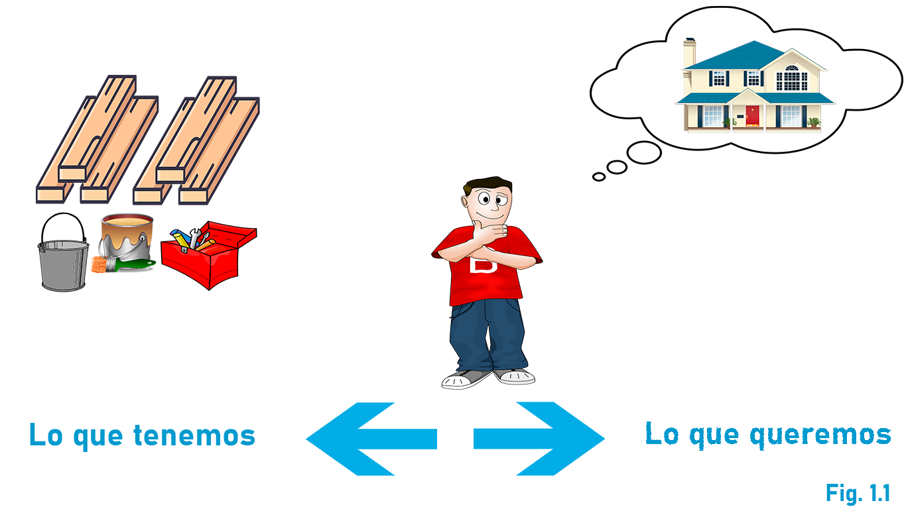
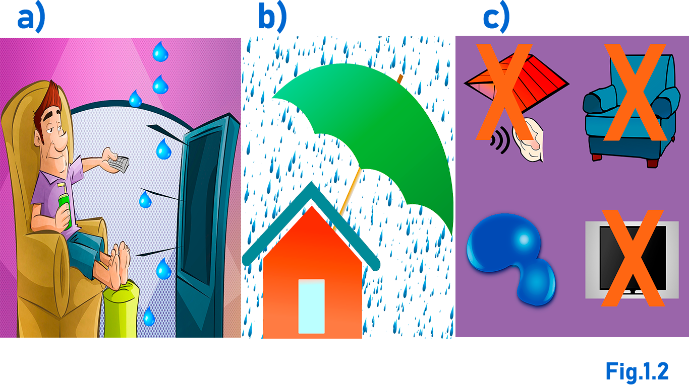

# Solución de Problemas

Empezaremos por abordar el concepto de problema en general. También, apreciaremos cómo se resuelven los problemas y al final aprenderemos cómo nos puede auxiliar la computadora para resolverlos.

### CONTENIDO:

1. Concepto de problema
2. Identificación del problema

## CONCEPTO DE PROBLEMA

Entendemos por **problema** una situación en la que las cosas que tenemos son diferentes de las que deseamos.

Veamos al personaje de la figura 1.1 quien desea tener una casa nueva; sin embargo, él sólo dispone de los maderos, las pinturas y las herramientas. En síntesis, desea una casa pero sólo tiene los materiales.

Para enfrentar las situaciones problemáticas se propone un método para "desenrredar" el problema y paulatinamente construir la solución. 

* Fase 1: Identificación del problema.
* Fase 2: Identificación de posibles soluciones.
* Fase 3: Diseño del método de resolución.
* Fase 4: Ejecución del método.

Antes de analizar cada fase conviene hacer notar que mientras más problemas se resuelven, menor es el esfuerzo requerido para enfrentar otros nuevos.

## IDENTIFICACIÓN DEL PROBLEMA

Un problema siempre surge en una situación más o menos compleja. Esto provoca que muchas veces no se aprecie el verdadero problema.

Para identificar un problema es necesario encontrar dentro de la situación todos los elementos importantes: aquellos que están presentes (lo que tenemos) y aquellos que están ausentes (lo que deseamos).

Pero veamos, el siguiente ejemplo de la figura 1.2 donde nuestro personaje está sentado en su casa viendo la televisión.

Afuera está lloviendo y como su techo está en mal estado el agua se introduce a la habitación.

¿Cuál es su problema? La figura 1.2 nos muestra algunos posibles problemas (todas las propuestas se obtuvieron observando la situación):

1. El problema es que la televisión no se ve bien.
2. El problema es que el sillón no es cómodo.
3. El problema es que las gotas hacen ruido.
4. El problema es que se está metiendo el agua a su casa.

Un análisis profundo de la situación (y con un poco de sentido común) podemos determinar que en realidad el problema consiste en que se está metiendo el agua a la casa: nuestro personaje tiene una gotera, pero no quiere esa gotera.
