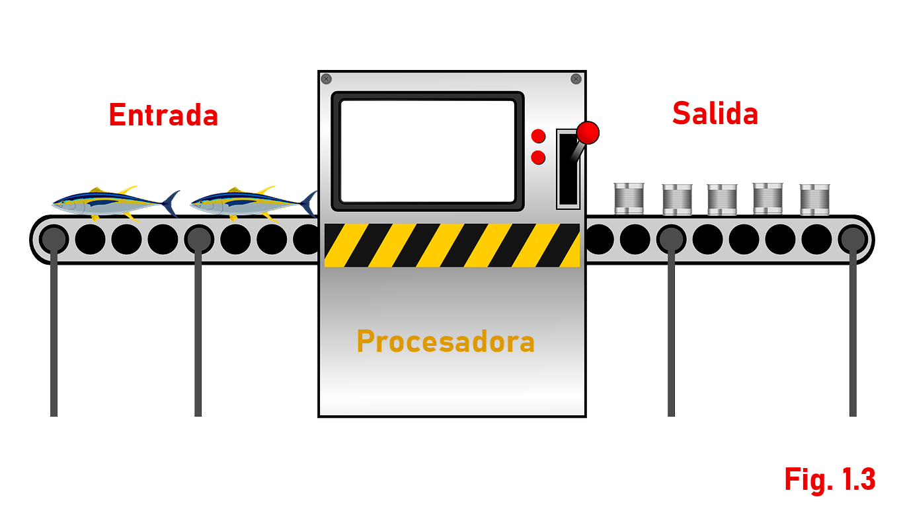
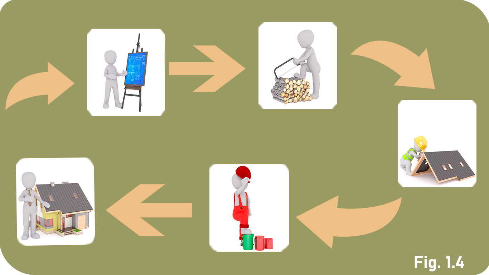

# Solución de Problemas

Empezaremos por abordar el concepto de problema en general. También, apreciaremos cómo se resuelven los problemas y al final aprenderemos cómo nos puede auxiliar la computadora para resolverlos.

### CONTENIDO:

1. Concepto de problema
2. Identificación del problema
3. Encontrar posibles soluciones
4. Diseño del método de resolución

## CONCEPTO DE PROBLEMA

Entendemos por **problema** una situación en la que las cosas que tenemos son diferentes de las que deseamos.

Veamos al personaje de la figura 1.1 quien desea tener una casa nueva; sin embargo, él sólo dispone de los maderos, las pinturas y las herramientas. En síntesis, desea una casa pero sólo tiene los materiales.

Para enfrentar las situaciones problemáticas se propone un método para "desenrredar" el problema y paulatinamente construir la solución. 

* Fase 1: Identificación del problema.
* Fase 2: Identificación de posibles soluciones.
* Fase 3: Diseño del método de resolución.
* Fase 4: Ejecución del método.

Antes de analizar cada fase conviene hacer notar que mientras más problemas se resuelven, menor es el esfuerzo requerido para enfrentar otros nuevos.

## IDENTIFICACIÓN DEL PROBLEMA

Un problema siempre surge en una situación más o menos compleja. Esto provoca que muchas veces no se aprecie el verdadero problema.

Para identificar un problema es necesario encontrar dentro de la situación todos los elementos importantes: aquellos que están presentes (lo que tenemos) y aquellos que están ausentes (lo que deseamos).

Pero veamos, el siguiente ejemplo de la figura 1.2 donde nuestro personaje está sentado en su casa viendo la televisión.

Afuera está lloviendo y como su techo está en mal estado el agua se introduce a la habitación.

¿Cuál es su problema? La figura 1.2 nos muestra algunos posibles problemas (todas las propuestas se obtuvieron observando la situación):

1. El problema es que la televisión no se ve bien.
2. El problema es que el sillón no es cómodo.
3. El problema es que las gotas hacen ruido.
4. El problema es que se está metiendo el agua a su casa.

Un análisis profundo de la situación (y con un poco de sentido común) podemos determinar que en realidad el problema consiste en que se está metiendo el agua a la casa: nuestro personaje tiene una gotera, pero no quiere esa gotera.

## ENCONTRAR POSIBLES SOLUCIONES

La solución a un problema es la acción que permite eliminar la diferencia entre lo que tenemos y lo que queremos.

Para un mismo problema se pueden tener varias soluciones, y la elección de la mejor dependerá de las circunstancias específicas.

En el ejemplo de la gotera observamos cuatro posibilidades de solución (Figura 1.2):

* Esperar con resignación a que acabe la lluvia (mientras se moja el piso).
* Colocar un paraguas en el techo.
* Reparar el techo.
* Colocar una cubeta bajo la gotera.

Cualquiera de estas soluciones es posible llevarla a la práctica; sin embargo, resulta casi obvio que las dos primeras son risibles: la resignación provocará que se dañen el piso y los muebles, y colocar un paraguas "le da la vuelta" al problema. La tercera solución es la mejor, pero considerando que está lloviendo, la solución inmediata es colocar la cubeta (y cuando no llueva reparar el techo).

En algunos otros casos las soluciones propuestas son poco factibles, otras fantásticas, y algunas otras falsas, pues no resuelven el problema sino lo evitan o crean otro. Por ejemplo, un problema de nutrición se soluciona (falsamente) con comida "chatarra".

## DISEÑO DEL MÉTODO DE RESOLUCIÓN

En la sección anterior aprendimos cómo encontrar la solución de un problema en particular. Sin embargo, saber cuál es la solución no significa que sepamos cómo haremos para obtenerla. En esta sección estudiaremos cómo se alcanzan las soluciones.

El método de resolución es una estrategía que sirve para alcanzar la solución de un problema. Dicha estrategía consta de un conjunto de transformaciones que convierten los elementos disponibles en los objetos deseados.

La Figura 1.3 nos ilustra estas ideas por medio de una *caja negra*, cuyo funcionamiento es el siguiente: los objetos entran a la caja, *algo* ocurre dentro de ella (una transformación), y otros objetos diferentes salen de la caja. Pero la caja negra no es mágica, el interior, el interior tiene un mecanismo que hace el trabajo y, lo más importante, alguien diseño ese mecanismo capaz de solucionar ciertos problemas.

Considerando lo anterior, diseñar el método de resolución consiste en definir cada uno de los pasos que nos llevarán a obtener la solución, es decir, explicar claramente cuál es nuestro plan de acción para alcanzar la meta. Podemos verlo en el primer ejemplo, la persona que desea una casa debe seguir los cuatro pasos de la figura 1.4 para lograr su propósito:

* Elaborar los planos de la casa.
* Cortar los maderos del tamaño adecuado.
* Construir puertas y techos.
* Pintar la casa.

Si nuestro personaje sigue estos cuatro pasos es seguro que podrá disfrutar de una casa nueva.

En general a la serie de pasos que permiten resolver un problema se le conoce como *algoritmo*, y es un tema en el que profundizaremos a lo largo del exto.

La última parte, la ejecución del método, ya no es un trabajo intelectual de análisis, sino "poner manos a la obra" y puede efectuarse por nosotros mismos o por otra persona que siga cuidadosamente las instrucciones que hemos diseñado.
